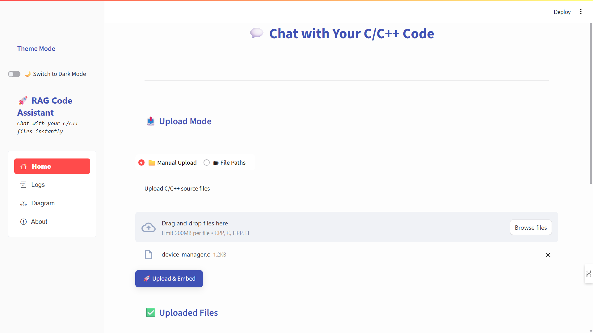
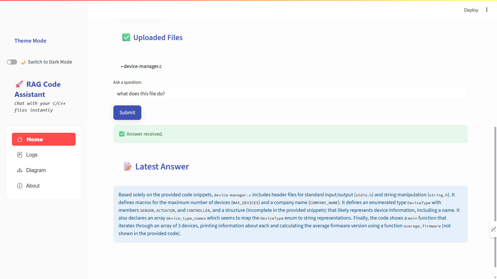

# 🚀 CodePilot-AI: RAG-Powered Code Assistant

**CodePilot-AI** is a powerful Retrieval-Augmented Generation (RAG) assistant built for understanding and answering questions about C/C++ codebases. It parses code files, splits them into semantically meaningful chunks, embeds them for similarity search, and answers queries using advanced LLMs like Gemini (and future-ready for CodeBERT).

---

## ✨ Features

- ✅ Upload and parse entire `.c`, `.cpp`, `.h`, `.hpp` codebases
- 🔍 Chunk-level semantic search using embeddings
- 🧠 Gemini/GPT-powered code Q&A
- 🎯 Line-accurate code parsing with file tracking
- 🌗 Theme toggle (Dark/Light mode)
- 📁 Visual file log viewer
- 📊 Chunk embedding & query matching logs
- 🔧 Modular API design (FastAPI)
- 📦 Ready for LLMs like CodeBERT or Open Source alternatives

---

## 🖼️ Screenshots

<table> <tr> <td align="center"> <strong>📂 File Upload Interface</strong><br>  </td> <td align="center"> <strong>💬 Query Response Output</strong><br>  </td> </tr> </table>


## 🛠️ Folder Structure

```bash
.
├── backend/
│   ├── api.py               # FastAPI backend for upload, parse, ask
│   ├── parser.py            # Advanced C/C++ code chunk parser
│   ├── parser_treesitter.py # Optional Tree-sitter parser
│   ├── retriever.py         # Chunk retrieval logic
│   ├── embedder.py          # Embedding and storage
│   └── generator.py         # Answer generation using Gemini / LLMs
│
├── frontend/
│   ├── app.py               # Streamlit frontend (multi-tab UI)
│   └── styles.py            # Centralized dark/light mode styling
│
├── data/
│   ├── codebase/            # Uploaded code files
│   ├── chunks.json          # Extracted chunks from code
│   └── query_logs.json      # Query + result log history
│
├── requirements.txt
└── README.md
```

---

## ⚙️ Setup Instructions

### 1. Clone the Repository

```bash
git clone https://github.com/me-As-Raki/CodePilot-AI.git
cd CodePilot-AI
```

### 2. Install Dependencies

> Create a virtual environment if needed.

```bash
pip install -r requirements.txt
```

### 3. Start the Backend

```bash
uvicorn backend.api:app --reload
```

Runs on: [http://127.0.0.1:8000](http://127.0.0.1:8000)

### 4. Start the Frontend (in a new terminal)

```bash
streamlit run frontend/app.py
```

---

## 🧠 How It Works

### 📁 File Upload
Upload `.c`, `.cpp`, `.h`, `.hpp` files. Files are saved in `data/codebase/`.

### 🧩 Code Chunk Parsing
Runs `parser.py` to extract:
- Function definitions
- Macros
- Typedefs, structs, enums
- Static arrays & driver tables
- Global variables

Saved in `data/chunks.json`.

### 🧬 Embedding
Embeds chunks using Gemini/Cohere vector models.

### 🔎 Retrieval
Query is matched against code chunks semantically using cosine similarity.

### 🗣️ Answer Generation
Prompt is built and passed to LLM (e.g., Gemini Pro, GPT-4, or CodeBERT soon).

---

## 🎛️ Frontend Features

- 🗂 **Tabs**: Ask | Logs | Diagram | About
- 🌓 **Theme Toggle**: Dark/Light switch
- 🎤 **Text Input**: Ask queries based on file uploaded
- 📈 **Logs**: Track previous questions and matched files
- 📚 **Pipeline Diagram**: Shows full RAG architecture
- 📌 **Sticky Upload/Ask** buttons with icons

---

## 🧪 Test Manual Parser

To test the manual parser from root:

```bash
python backend/parser.py
```

Check `data/chunks.json` for results.

---

🚀 Running the Application  
🖥️ Start the Backend API:

```bash
uvicorn backend.api:app --reload
```

Logs visible in terminal for each API hit.  
Runs locally at: [http://127.0.0.1:8000](http://127.0.0.1:8000)

🌐 Start the Frontend App (in another terminal):

```bash
streamlit run frontend/app.py
```

Includes:

✅ Dark/Light theme toggle  
✅ Voice typing support  
✅ Tabbed layout: Ask • Logs • Diagram • About

---

## 🧾 Requirements

```
streamlit
fastapi
uvicorn
requests
cohere
speechrecognition
pydub
python-dotenv
```

Install with:

```bash
pip install -r requirements.txt
```

---
